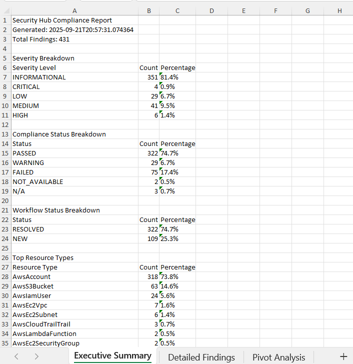

# Automating Excel Reports from AWS Security Hub – My Beginner Journey

This repo contains my personal learning notes from working through the [Security Hub to Excel Reporting](https://www.patreon.com/posts/136434191?collection=1606822) lab. The lab itself contains the full code and official setup guide. 

The project itself automates the creation of audit-ready Excel reports directly from AWS Security Hub findings, using Lambda, S3, and CloudFormation. GRC teams perform automation, while audit teams get the Excel report.

What I’ve outlined here isn’t a replacement for the original guide. Instead, it’s a collection of extra reflections like things I struggled with, how I solved them, and lessons I learned along the way.

If you’re new to AWS like me, this is a great hands-on way to practice:
- Deploying a CloudFormation stack
- Using AWS Lambda
- Managing S3 buckets
- Running commands with the AWS CLI

My goal is to make the journey a little easier for other AWS beginners.

---

## Table of Contents
- [Common Issues I Faced](#common-issues-i-faced)  
  - [1. S3 bucket names with dots](#1-s3-bucket-names-with-dots)  
  - [2. PowerShell vs Git Bash](#2-powershell-vs-git-bash)  
  - [3. CloudFormation template extension](#3-cloudformation-template-extension)  
  - [4. File paths in Windows](#4-file-paths-in-windows)  
  - [5. Running multiple lines at once](#5-running-multiple-lines-at-once)  
  - [6. CloudFormation template not found](#6-cloudformation-template-not-found)  
- [Validation and Testing](#validation-and-testing)  
  - [1. Verifying deployment](#1-verifying-deployment)  
  - [2. Testing the Lambda](#2-testing-the-lambda)  
  - [3. Finding the report in S3](#3-finding-the-report-in-s3)  
- [Lessons Learned](#lessons-learned)  
- [Final Outcome](#final-outcome)  
- [Quick Troubleshooting Cheatsheet](#quick-troubleshooting-cheatsheet)  
- [Resources](#resources)  
 
---

## Common Issues I Faced  

### 1. **S3 bucket names with dots (.)**  
- I first created a bucket with a decimal in the name (e.g., `mybucket.name`). This caused SSL validation problems when uploading files.  
- **Fix**: use hyphens (instead of dot), lowercase letters, numbers e.g. `my-bucket-name`.  

---

### 2. **PowerShell vs Git Bash**  
- Using PowerShell on Windows gave me constant issues with environment variables and paths.  
- **Fix**: Switching to **Git Bash** solved almost everything. Paths like `/c/Users/...` just worked.

---

### 3. **CloudFormation template YAML extension**  
- I kept typing .yml in `cloudformation-template.yml`.  
- The actual file was `cloudformation-template.yaml`. Extensions matter!  

---

### 4. **File paths in Windows**  
- I first tried this which is wrong in Git Bash:  `C:\Users\angie\Documents...`
- Correct in Git Bash:  `/c/Users/angie/Documents/...`

---

### 5. **Running multiple lines at once**  
- I wasn’t sure if I needed to run blocks of code all at once.  
- **Solution**: run one line at a time unless it’s clearly a single command split across multiple lines with `\` (backslash).  

---

### 6. **CloudFormation template not found**  
- The error I got was:  `Invalid template path cloudformation-template.yml`
- **Fix**: make sure you’re in the same folder as the file by typing `pwd` or `ls -l` before running the deploy command.  

---

## Validation and Testing

### 1. **Verifying deployment**  
- After deployment, CloudFormation said:

`Successfully created/updated stack`

`Deployment complete!`
- That meant the Lambda and resources were created correctly.  

---

### 2. **Testing the Lambda**
- Invoking the Lambda gave me:  
```json
{
  "StatusCode": 200,
  "ExecutedVersion": "$LATEST"
}
```
- This confirmed the Lambda ran without errors.

---

### 3. **Finding the report in S3**
- Running `aws s3 ls s3://my-bucket/reports/` showed the Excel file.
- Downloading worked, and I was able to open the Excel report locally.

---

## Lessons Learned

- Git Bash is friendlier than PowerShell for AWS CLI on Windows.
- Always double-check filenames and extensions (.yaml vs .yml).
- S3 bucket names must be unique and avoid dots.
- Run commands line by line to avoid confusion.
- Use `pwd` and `ls` often. Knowing where you are prevents most path errors.
- `echo` in scripts is just for printing messages, it doesn’t affect AWS.
- A `StatusCode: 200` from Lambda means your function executed successfully.
- Small mistakes (like a wrong extension or bucket name) can break automation pipelines but fixing them teaches you how fragile and important consistency is in cloud work.
- This project reminded me that automation isn’t just about code; it’s about delivering results in a format people actually use (in this case, Excel for auditors).

---

## Final Outcome

- Built and deployed the full pipeline successfully.
- Generated an Excel report from Security Hub findings.
- Downloaded the file locally and confirmed it opened in Excel.
- Sample of the final Excel report can be found in the Resources section below.

---

## Quick Troubleshooting Cheatsheet

| Error / Issue                                       | Fix                                                                                                      |
| --------------------------------------------------- | -------------------------------------------------------------------------------------------------------- |
| `Invalid template path cloudformation-template.yml` | Make sure the file is named `.yaml` and you’re in the right folder (type `pwd` and `ls`).                |
| SSL errors when uploading to S3                     | Don’t use dots `.` in bucket names. Use only letters, numbers, and hyphens.                              |
| `command not found` after pasting                   | In Git Bash, run commands line by line. Remove `^[[200~` if your terminal adds it.                       |
| Wrong file path                                     | In Git Bash, use `/c/Users/...` instead of `C:\Users\...`.                                               |
| Nothing in S3 `/reports/`                           | Check Lambda logs in CloudWatch. Usually means Security Hub has no findings or permissions are missing.  |
| Unsure if Lambda worked                             | A `StatusCode: 200` in the JSON response means it executed successfully.                                 |

---

## Resources  

- Full project (code and instructions): [AWS Security Hub to Excel Pipeline](https://www.patreon.com/posts/136434191?collection=1606822)  
- [AWS CLI Reference](https://docs.aws.amazon.com/cli)  
- [S3 Bucket Naming Rules](https://docs.aws.amazon.com/AmazonS3/latest/userguide/bucketnamingrules.html)  
- [CloudFormation Basics](https://docs.aws.amazon.com/AWSCloudFormation/latest/UserGuide/Welcome.html)  

<details> <summary> <strong>Quick deployment guide</strong> (click to expand)</summary>
  
**Step 1**: Set up your environment. 
```bash
aws configure sso
aws sts get-caller-identity
```

**Step 2**: Create S3 bucket and upload source.  
Run these commands one line at a time:
```bash
export BUCKET_NAME="security-hub-reports-$(date +%s)"
echo "Creating bucket: $BUCKET_NAME"
aws s3 mb s3://$BUCKET_NAME --profile profilename
aws s3 cp lambda-source.zip s3://$BUCKET_NAME/source/lambda-source.zip --profile profilename
```

**Step 3**: Deploy infrastructure.
```bash
aws cloudformation deploy \
  --template-file cloudformation-template.yaml \
  --stack-name security-hub-excel-pipeline \
  --capabilities CAPABILITY_NAMED_IAM \
  --parameter-overrides S3BucketName=$BUCKET_NAME \
  --profile profilename && echo "Deployment complete!"
```

The following messages will appear in your terminal:
```text
Waiting for changeset to be created..
Waiting for stack create/update to complete
Successfully created/updated stack - security-hub-excel-pipeline
Deployment complete!

```

**Step 4**: Test the function.
```bash
# generate the excel report
aws lambda invoke \
  --function-name security-hub-excel-generator-cf \
  --output json response.json \
  --profile profilename
```
Output in terminal:
```text
{
    "StatusCode": 200,
    "ExecutedVersion": "$LATEST"
}
```
```bash
# check the response
cat response.json
```
Output in terminal:
```text
{"statusCode": 200, "body": "{\"message\": \"Security Hub Excel report generated successfully\", \"bucket\": \"security-hub-reports-1758548527\", \"key\": \"reports/security_hub_report_20250922_142528.xlsx\", \"findings_count\": 441, \"timestamp\": \"20250922_142528\", \"worksheets_created\": [\"Executive Summary\", \"Detailed Findings\", \"Pivot Analysis\"]}"}
```

``` bash
# view/list available report in S3
aws s3 ls s3://$BUCKET_NAME/reports/ --profile profilename
```
Output in terminal:
```text
2025-09-22 09:25:34     103623 security_hub_report_20250922_142528.xlsx
```

**Step 5**: Download your report.

``` bash
aws s3 cp s3://$BUCKET_NAME/reports/security_hub_report_20250921_205728.xlsx ./my-security-report.xlsx --profile profilename
```
Output in terminal:
```text
download: s3://security-hub-reports-1758548527/reports/security_hub_report_20250922_142528.xlsx to .\my-security-report.xlsx
```

```bash
# open the excel file (using this command in Git Bash on Windows):
start my-security-report.xlsx
```

</details>

<details> <summary> <strong>Sample Excel report</strong> (click to expand)</summary>



</details>

---

This README is a companion from a beginner's perspective, a set of extra notes from my own learning experience. I hope it helps other learners avoid some of the bumps I hit.

